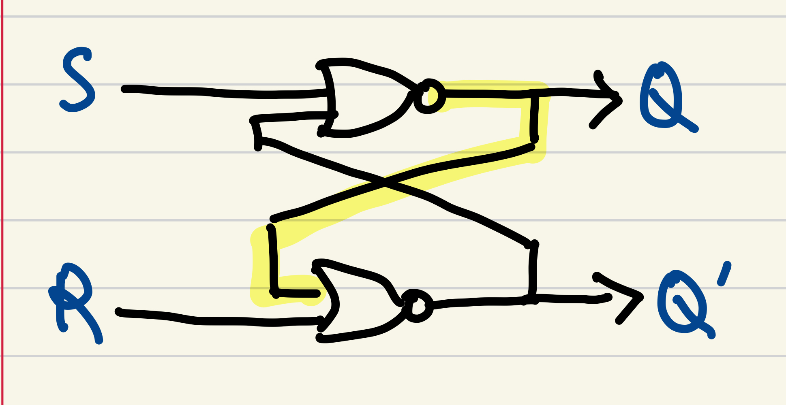
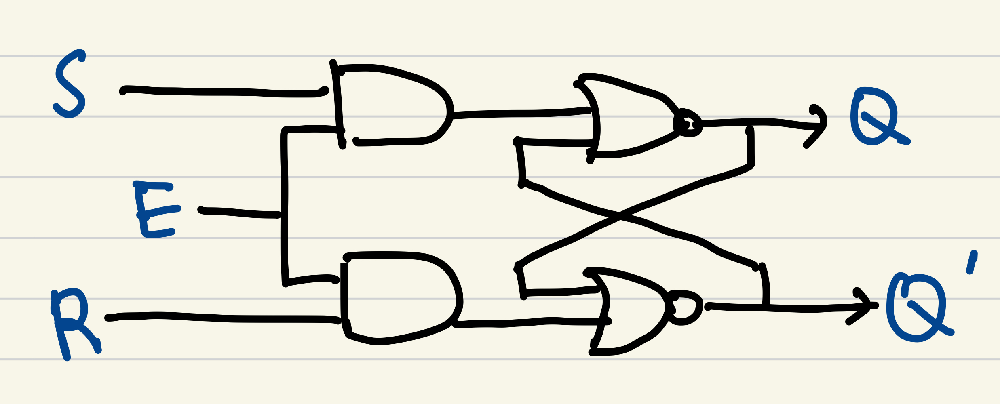
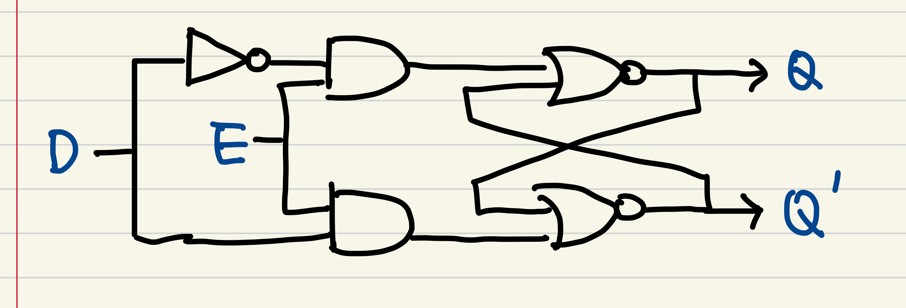

# Synchronous Sequential Logic

## Sequential Logic

Sequential logic circuits are those where the output not only depends on the current inputs but also on the history of inputs. This is in contrast to combinational logic, where the output is a direct function of the current inputs only. Sequential logic circuits utilize storage elements like latches and flip-flops to remember past inputs, making them integral to memory and timing operations in digital systems.

## Latches

### SR Latch

- [SR Latch Video Explanation](https://www.youtube.com/watch?v=KM0DdEaY5sY)

An SR (Set-Reset) latch is a basic memory storage element. It consists of two NOR gates arranged in a feedback loop. The fundamental operation of the SR latch is based on the behavior of the NOR gate, which outputs 1 when both inputs are 0.

1. **Set Condition**: When the Set (S) input is activated (logic 1), the output Q is set to 1, and Q' (the inverse of Q) is set to 0. This state is maintained even after the S input is deactivated, due to the feedback loop.

2. **Reset Condition**: When the Reset (R) input is activated (logic 1), the output Q is reset to 0, and Q' becomes 1.

3. **Hold Condition**: When both S and R inputs are 0, the latch maintains its current state.

4. **Invalid State**: In the case of both S and R being 1, the outputs Q and Q' are both 0, which is not allowed since Q and Q' should always be opposites.

An SR latch can also be implemented using NAND gates, but the logic levels are inverted: activating S or R with a 0 instead of 1 will set or reset the latch, respectively.

### D Latch

- [D Latch Video Explanation](https://www.youtube.com/watch?v=peCh_859q7Q)

The D latch improves upon the SR latch by ensuring that invalid states are avoided. It introduces an enable signal (E) to control the state of the latch.

1. **Enable Off**: When the enable signal (E) is low (0), the D latch ignores the D input and retains its previous state.

2. **Enable On**: When the enable signal (E) is high (1), the state of the latch is updated according to the D input. If D is high, the latch sets; if D is low, the latch resets.

To simplify the design, the D latch combines the S and R inputs into a single D input, ensuring that the inputs are always complementary (S = D and R = NOT D).

## Latch vs Flip-Flop

The main difference between latches and flip-flops is the way they are triggered:

- **Latches** are level-sensitive, meaning they change state as long as the enable signal is active.
- **Flip-Flops** are edge-sensitive, meaning they change state only at the rising or falling edge of the clock signal.

## Flip-Flops

### D Flip-Flop

- [D Flip-Flop Video Explanation](https://www.youtube.com/watch?v=YW-_GkUguMM&t=3s)

A D flip-flop is similar to a D latch but includes a clock signal to control the timing of state changes.

1. **Edge-Triggered**: The D flip-flop captures the value of the D input at the moment of a clock edge (either rising or falling) and holds this value until the next clock edge.

This makes D flip-flops ideal for synchronizing data transfers and creating stable memory elements in digital systems.

### JK Flip-Flop

- [JK Flip-Flop Video Explanation](https://youtu.be/F1OC5e7Tn_o?si=FFt0oLCrLbYHaY-P)
- [Further Explanation on JK Flip-Flop](https://youtu.be/st3mUEub99E?si=f48DxPT4vFkH7DSc)

The JK flip-flop addresses the limitation of the SR flip-flop by allowing valid operations for all input combinations:

1. **J = 1, K = 0**: Sets the output Q to 1.
2. **J = 0, K = 1**: Resets the output Q to 0.
3. **J = 0, K = 0**: Retains the previous state.
4. **J = 1, K = 1**: Toggles the output Q.

This flexibility eliminates the invalid state problem found in SR flip-flops.

### Master-Slave JK Flip-Flop

- [Master-Slave JK Flip-Flop Video Explanation](https://youtu.be/rXHSB5w7CyE?si=Qy-dqbCsZ7KueELz)

To prevent the issue of race conditions (where changes in the output occur faster than intended), the master-slave JK flip-flop uses two JK flip-flops in series:

1. **Master Flip-Flop**: Captures the input on the leading edge of the clock pulse.
2. **Slave Flip-Flop**: Captures the state of the master flip-flop on the trailing edge of the clock pulse.

This configuration ensures that changes only occur at distinct clock edges, providing stable and predictable operation.

### T Flip-Flop

A T (Toggle) flip-flop is a simplification of the JK flip-flop, where both J and K inputs are connected together to form a single T input.

1. **T = 0**: Maintains the current state.
2. **T = 1**: Toggles the state of the output.

T flip-flops are often used in counters and toggle operations due to their simplicity and efficiency.
